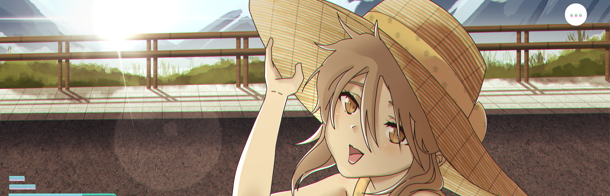

<h1 align="center">The XRUIOS</h1>

  

**The full XRUIOS solution: one Manager, a worker per class, and a permission wall between every one of them.**

This is the assembled system, ported from [XRUIOS.Barebones](https://github.com/Walker-Industries-RnD/XRUIOS.Barebones) onto the Plagues trust model. Barebones was one project with ~400 functions. Here each system class is its own **worker process** with its own password and its own key, and a single **XRUIOS.Manager** holds the master key, gates login, and brokers every request through a permission check.

This wiki is about the permissions. If you want the function catalog, that lives in the Barebones wiki; here we cover the walls: the groups, the per-worker isolation, the login that unlocks everything, and how one program shares data with another without either of them touching a key they shouldn't.

This is a project I knew I wanted to make back since 2017 and after thousands of hours of work, grinding and time it seems things are finally coming together.

The XRUIOS.XR library and Linux Distro are next, although keep in mind the XRUIOS works on Linux and Windows right now.

## Click the image to view the 3D Spatial Environment coming soon! 

---

## What The XRUIOS is trying to be

The XRUIOS is ultimately an attempt to build a **spatial operating environment rather than simply another VR application**.

There are already projects moving in this direction. [Stardust XR](https://github.com/StardustXR/server), for example, approaches XR as a Linux display server and spatial environment where traditional 2D applications and native 3D applications can coexist in physical space. Other projects such as Ethereal Engine/XREngine approach the problem from the perspective of the open social spatial web, while WebXR-based systems demonstrate that immersive experiences can increasingly move between browsers, desktops, phones, and headsets.

The XRUIOS takes inspiration from that general direction, but its priorities are somewhat different.

The goal is not to make XR something that requires the user to understand **OpenXR, runtimes, drivers, compositor architecture, IPC, certificates, permissions, or cryptographic identities** before they can use it.

The goal is to make those things disappear behind the operating environment.

**Install it. Run it. Open an application.**

Whether the user is wearing a headset, using AR glasses, sitting at a conventional monitor, or interacting with another device should be an implementation detail rather than a fundamental division in the platform.

## The three walls

1. **Process isolation.** One class per worker. Compromise the Songs worker and you still can't reach Calendar's code - it isn't loaded there.
2. **Password isolation.** Each worker has its own PSK. Only the Manager holds it, so only the Manager can talk to a worker, and a leaked PSK unlocks exactly one worker.
3. **Key isolation.** Each worker's store is encrypted under its own key, derived from the master. A worker only ever receives its own key, so a breach reads its own data and nothing else.

> "Least privilege isn't a setting. It's the architecture."

---

|                                                                              |                                                                                                                                        |
|-----------------------------|-----------------------------|
| **Code by WalkerDev** "Loving coding is the same as hating yourself" [Discord](https://discord.gg/H8h8scsxtH) | **Art & Code by Kennaness** "When will I get my isekai?" [Bluesky](https://bsky.app/profile/kennaness.bsky.social) • [ArtStation](https://www.artstation.com/kennaness) |

 

---

## License & Artwork

**Code:** [NON-AI MPL 2.0](https://raw.githubusercontent.com/non-ai-licenses/non-ai-licenses/main/NON-AI-MPL-2.0)
**Artwork:** — **NO AI training. NO reproduction. NO exceptions.**

> Unauthorized use of the artwork — including but not limited to copying, distribution, modification, or inclusion in any machine-learning training dataset — is strictly prohibited and will be prosecuted to the fullest extent of the law.
